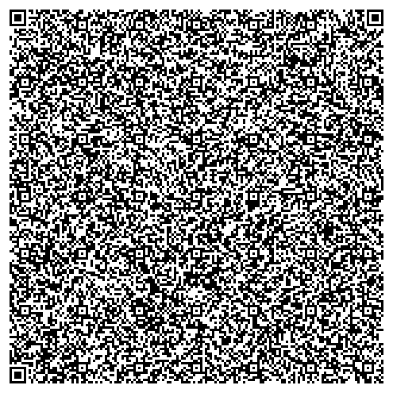

# example Signatures

Generate some PKI signatures to measure their respective sizes (e.g. as a CMS).

In this exampe 70 bytes or 388 bytes

With a realistic fHIR vac record as a protobuf (and some 'xz -e' compression as the current protobuf contains a lot of duplicated references to for example Snowmed) - just shy of 1kByte that would go into the QR.

